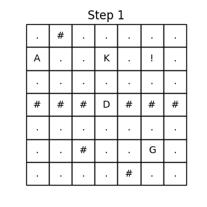
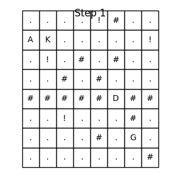
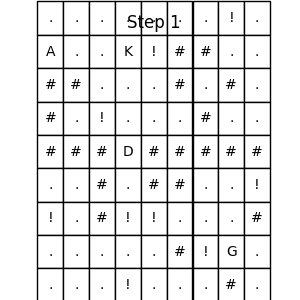
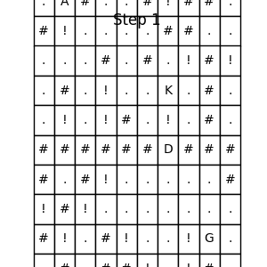
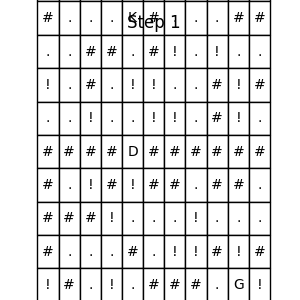

# GridWorld Tematico - RL con livelli procedurali, chiave e porta sbloccabile

Progetto completo di Reinforcement Learning per un ambiente GridWorld personalizzato con porta bloccata, chiave obbligatoria, livelli procedurali e pipeline di training/valutazione pronta per un esame universitario.

## Caratteristiche principali
- Ambiente `gridworld.GridWorldEnv` compatibile Gymnasium con osservazioni multicanale, penalità configurabili e render testuale.
- Generatore procedurale (`gridworld.level_generator`) che produce 5 livelli JSON di difficoltà crescente con ostacoli, zone rischiose e porta che separa il goal.
- Pipeline RL (`agents/train.py`) che supporta DQN e PPO, logging CSV, curve di reward, heatmap visite, suite di test automatica, report di efficacia e GIF del miglior episodio.
- Script di valutazione (`agents/evaluate.py`) con replay GIF, test suite ufficiale, comparazione multipla di modelli e generazione di report CSV/TXT.

## Stato del Progetto (26/11/2025)

### Risultati Attuali
- **Suite Fissa (Livelli 1-5):** **100% Success Rate**. Il modello ha risolto perfettamente tutti i livelli di training.
- **Generalizzazione (Livelli Mai Visti):** **90% Success Rate**. Su un set di 10 livelli procedurali mai visti (2 per ogni difficoltà), l'agente ha risolto 9 livelli su 10, fallendo solo in uno scenario di difficoltà 4 particolarmente complesso.

### Configurazione Vincente
- **Algoritmo:** Dueling DQN con Frame Stacking (4 frame).
- **Ambiente:** Griglia 8x8, Penalità ripetizione -1.0, Reward Chiave +10.0, Reward Goal +50.0.
- **Training:** 5 Milioni di timesteps con strategia Mixed (80% procedurale / 20% fisso).
- **Hardware:** Training accelerato su GPU (CUDA) con generazione dati parallela su CPU (12 envs).

### Prossimi Passi
- Analisi del fallimento sul livello procedurale "Test Level 7" (Difficoltà 4).
- Possibile estensione a griglie 10x10.

## Struttura del progetto
```
project_root/
    gridworld/
        __init__.py
        env.py
        utils.py
        level_generator.py
    agents/
        train.py
        evaluate.py
    levels/
        level_1.json ... level_5.json
    output/
        models/
        logs/
        gifs/
        plots/
        trajectories/
    README.md
    requirements.txt
```

## Requisiti
Installare le dipendenze consigliate (Python 3.10+):
```
pip install -r requirements.txt
```

## Addestramento
Esempi di comandi:
```
python agents/train.py --algo dqn --timesteps 200000
python agents/train.py --algo ppo --timesteps 300000 --train-on-procedural
python agents/train.py --algo dqn --config levels/level_3.json --timesteps 150000
# Mixed Training (Strategia Corrente):
python agents/train.py --train-mixed --timesteps 1000000 --load-model output/models/dqn_final.zip
```
Lo script salva automaticamente:
- Modello finale in `output/models/<algo>_final.zip` (+ metadati JSON).
- `output/logs/training_logs.csv` e `output/plots/reward_curve.png`.
- Suite di test (CSV/TXT) + `output/plots/model_effectiveness.png`.
- GIF `output/gifs/best_episode.gif` e PNG `output/trajectories/best_episode.png`.

## Valutazione e report
Valutazione semplice su un livello:
```
python agents/evaluate.py --model_path output/models/dqn_final.zip --level 3 --episodes 10 --deterministic --save_gif
```
Esecuzione test suite ufficiale (5 livelli × 20 episodi) e generazione report:
```
python agents/evaluate.py --model_path output/models/dqn_final.zip --run_suite
```
Output principali:
- `output/test_suite_report.csv`
- `output/effectiveness_report.txt`
- GIF opzionale `output/gifs/best_episode.gif`

## Comparazione modelli
```
python agents/evaluate.py --compare_models output/models/dqn_final.zip output/models/ppo_final.zip
```
Genera `output/model_comparison.csv` e `output/model_comparison.png` con il confronto dei success rate livello-per-livello.

## Generazione livelli
I 5 livelli ufficiali vengono generati automaticamente al primo avvio. È possibile crearne di nuovi invocando:
```python
from gridworld.level_generator import generate_level, save_level_to_json
level = generate_level(difficulty=3, seed=123)
save_level_to_json(level, "levels/custom_level.json")
```

## Output richiesti
Al termine del training saranno prodotti automaticamente:
- Modello `.zip` + metadati.
- `reward_curve.png`, `model_effectiveness.png`.
- `training_logs.csv`, `test_suite_report.csv`, `test_suite_report.txt`, `effectiveness_report.txt`.
- `best_episode.gif` e PNG delle traiettorie migliori.

## Risultati Visivi

Ecco i risultati dell'agente DQN addestrato sulla suite di livelli fissi.

### Livello 1 (Successo)


### Livello 2 (Successo - Oscillazione risolta)


### Livello 3 (Successo)


### Livello 4 (Successo)


### Livello 5 (Successo - 100%)

*Nota: Il livello 5 è stato risolto con successo grazie a un training esteso (1M step) e una maggiore esplorazione.*
